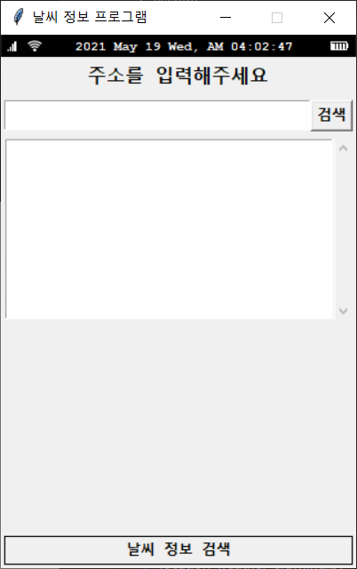
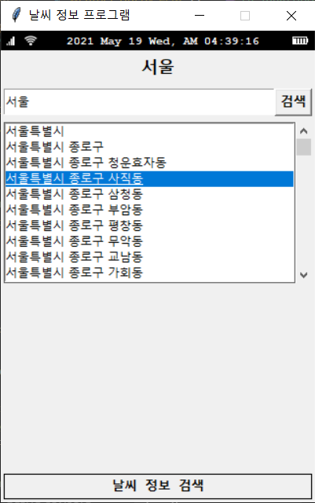
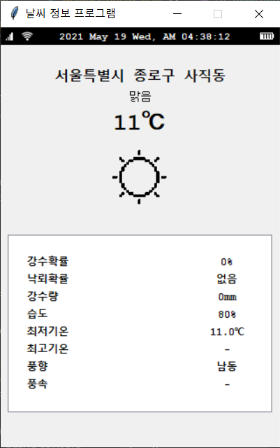

# Wearher Info Project
>가상환경 실행 
`conda activate myvenv`

>가상환경에 프로그램 설치 
`pip install -r requirements.txt `

---

## <b>기능</b>
<b>공통 기능</b>
- tkinter 패키지를 이용한 ui
- 날씨 정보 안내 화면 애니메이션 효과

<b>WeatherInfoProject_Hi</b>
- [도로명 주소 API](https://www.juso.go.kr/addrlink/devAddrLinkRequestGuide.do?menu=roadApi) 활용
- 날씨 정보 크롤링 

<b>WeatherInfoProject_Hz</b>
- [기상청 날씨 정보 API](https://www.weather.go.kr/weather/lifenindustry/sevice_rss.jsp) 활용 
- csv파일 읽어오기  

---

## <b>실행화면</b>
<b>WeatherInfoProject_Hi</b>

<b> WeatherInfoProject_Hz</b>  
  
